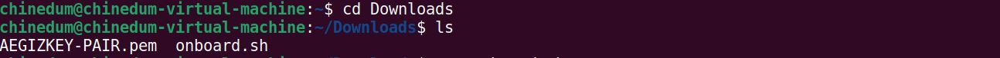
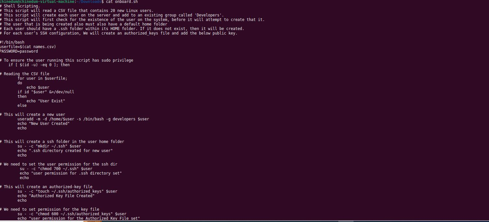
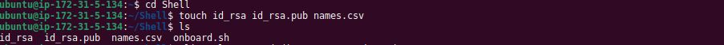
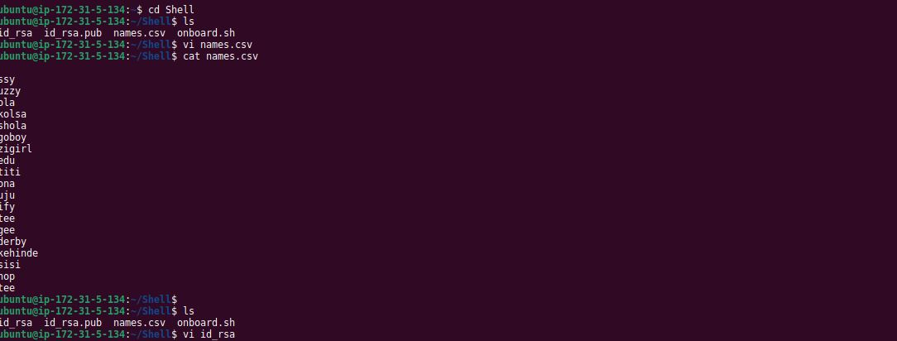
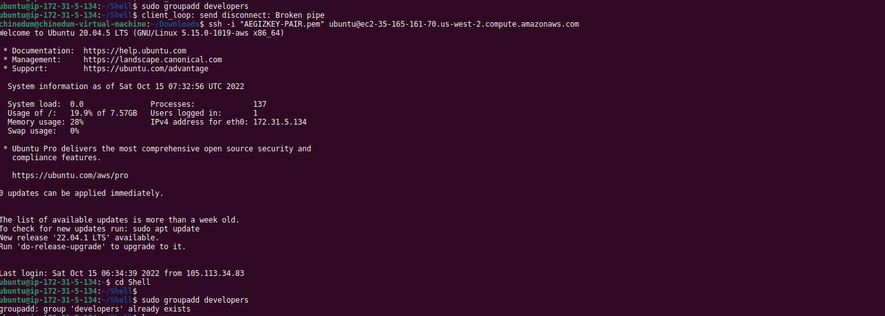
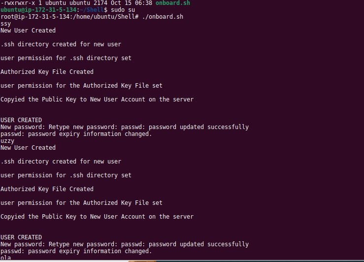
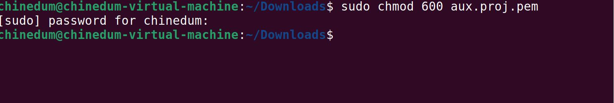
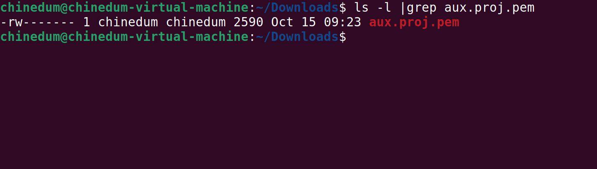
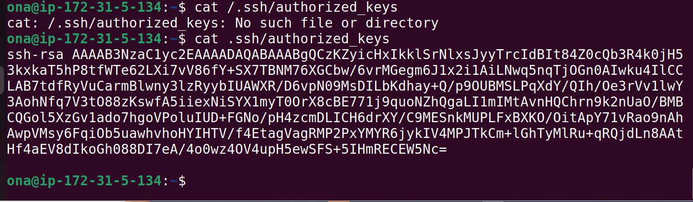

	# AUX PROJECT 1: SHELL SCRIPTING

	**In this project, i am to onboard 20 new Linux users onto a server. Create a shell script that reads a csv file that contains the first name of the users to be onboarded.bold text**

`First i went to my Ec2 console and created a new instance and named it Aux-Project 1. I used my already exisitin Sec-group which was a=saved to my Downloads folder`

 `i followed the video by David on the project implematation and used scrippting for the project which i saved on my downloads as well`

 `I went to my Ec 2 instance and use d the scp command to copy the files to the aux-project1 instance and it worked`

`I followed the documentation and created the Shell folder & Cd into the folder.`

`I created a file and named it onboard.sh and moved the file to the Shell Directory"`

`I created 3 new files ; id_rsa, id_rsa.pub and names.csv`

`I edited the files using VI and added the public key provided to the id_rsa.pub , private ket=y to id_rsa and names to onboard at names.csv`

`I used the groupadd command to add a new group named "developers"`

`I switched to super user usong the sudosu command and was able to add driectory"`

`I checked to confirm if my home directory was working and it was working perfectly"`

`I opened a new window and tried to enter the server using a name i cerated "ona" but because it was not secured i had to use the chmod 600 command to add some protection to it.`

`I was finally able to connect the server as a user with the name "ona" I used the public key on the Ec2 console and connected as a user with the name Ona.`

